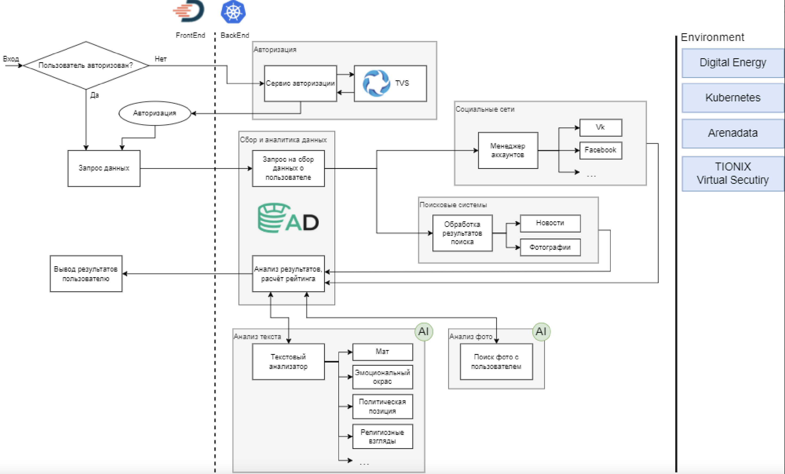
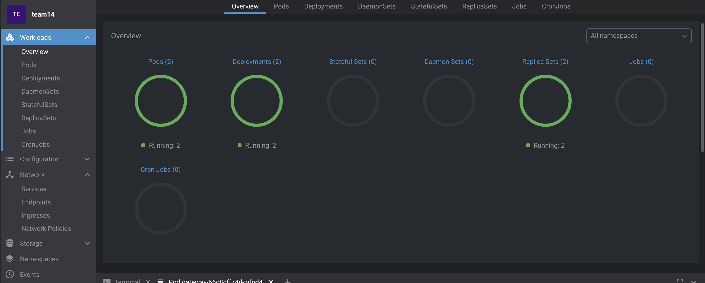
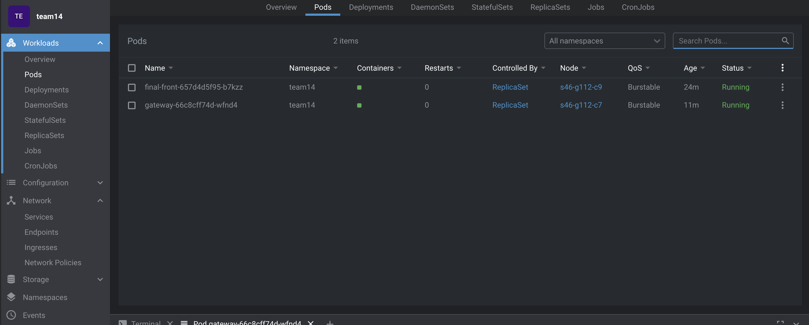
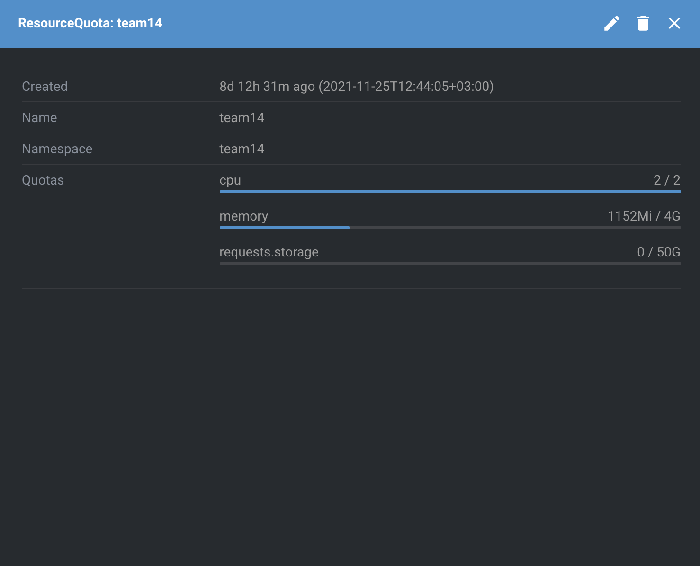

# Digital Twin

## Функциональность

- Авторизация пользователя через ГосУслуги с помощью Tionix TVC
- Выгрузка пользователю информации о нем из HDFS

## План развития серверной части

- Прикрепление учетной записи социальной сети (или другого источника информации, требующего авторизации)
 через авторизацию средствами внешнего сервиса (к примеру, vk api в связке с Tionix TVC)
- Поиск через API крупных социальных сетей и источников информации (VK, Одноклассники, Twitter, Instagram, YouTube)
- С использованием ArenaData и внешних инструментов проводить оценку текста клиента и о нем в различных плоскостях:
анализ грамотности, эмоциональности, наличие противоправных заявлений (оскорбления, клевета и т.д.)
- Выделить отдельные микросервисы для работы с HDFS (`big_data_service`), анализа текстов (`text_analyzer`), 
коннекторы к социальным сетям (`vk_connector`), шлюз (`gateway`). Для асинхронного взаимодействия использовать
брокер сообщений (`kafka`).
- Хранение данных бизнес-логики (идентификаторы пользователей, социальная репутация и т.п.) хранить 
в `MongoDB`
  
## Целевая архитектурная схема 



## Особенность проекта

Развернуто в облачной платформе `Digital Energy`, что увеличивает скорость разработки и поставки решения
Используется `ArenaData` (в перспективе) для работы с большими данными
Используются инструменты `Tionix`
Инфраструктура `Digital Energy`, `ArenaData`, `Tionix` решают проблемы инфраструктуры, позволяя
выделять больше ресурсов на разработку бизнес-логики решения
Микросервисная архитектура (в перспективе) внутри k8s кластера

## Основной стек технологий 
- Java 8
- Spring Boot 2
- Spring Cloud
- Maven
- GIT
- Docker
- Kubernetes
- ArenaData
- Lens

## Demo

Сервер развернут на `45.134.255.154:30007` . Для работы с ним можно воспользоваться 
[postman коллекцией](postman/DigitalTwin.postman_collection.json). 
1. **_Получение токена type=password_** с указанием в заголовке логина(username) и пароля(password). Сохранить значение
   `access_token`
2. **_Авторизация_** в заголовке Authorization указать `Bearer <access_token>`, где `<access_token>` из 
предыдущего шага. Ответ ФИО пользователя
3. **_Анализ текста_** в заголовке указать токен аналогично предыдущему пункту. В случае успеха в ответе будет
`taskId`. Возможен статус 401. Значит, токен истек или указан неверно. Следует начать с пункта 1
4. **_Анализ текста Результат_** в заголовке указать токен аналогично предыдущему шагу. Путь запроса изменить,
а именно убрать последнее значение пути (значение после последнего слэша /) и вставить вместо него
`taskId` из предыдущего пункта. В ответе будет набор заголовков о человеке из HDFS
   
Фронт развернут на `45.134.255.154:30008`. С использованием браузера можно посмотреть систему целиком
[Digital Twin](http://45.134.255.154:30008)

## Поставка на k8s

1. Создать докер образ из директории проекта локально командой `docker build -t <container-name> . ` - `container_name` имя контейнера.
Например:
```
docker build -t digital-twin-gateway . 
```

2. Протегать контейнер командой `docker tag <container-name> <docker-hub>/<container-name-for-docker-hub>:<version>`- 
где `<container-name>`  - имя контейнера из 1-го шага, `<docker-hub>` - логин для docker hub, `<container-name-for-docker-hub>` - 
имя контейнера для публикации в докер-хабе, `<version>` - версия. Например:
```
docker tag digital-twin-gateway vladimirkurovx5/digital-twin-gateway:1.0.9
```
3. Отправить контейнер в докер хаб командой `docker push <docker-hub>/<container-name-for-docker-hub>:<version>`
Например:
```
docker push vladimirkurovx5/digital-twin-gateway:1.0.8
```
4. В файле [kube](kube/gateway.yaml) обновить версию образа докера
5. Выполнить команду, где необходимо указать путь до директории [kube](kube) и путь до файла с конфигами 
   для подключения к стенду: 
```
kubectl apply -f <path-to-kube-directory> --kubeconfig=<path-to-kube-config>
```

6. Наблюдать работу подов можно с использованием утилиты [kubectl](https://kubernetes.io/ru/docs/tutorials/) 
или приложения [Lens](https://k8slens.dev)

## Обзор состояния кластера Kubernetes



## Поды приложения



## Ресурсы приложения



## Разработчики
- Павел Колбасов @ko1bas
- Владимир Куров @VladimirKurov
- Алексей Родионов @rodial